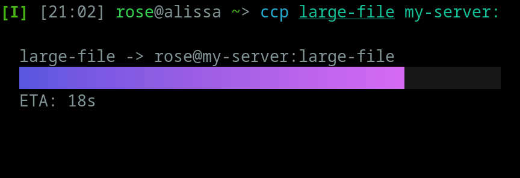

# ccp: a cute terminal file copy utility

ccp is your new favorite replacement for scp.

 - ✨ Colorful progress bar using [Bubble Tea](https://github.com/charmbracelet/bubbletea)
 - 📂 Copy directories recursively
 - ⏳ Shows estimated time remaining
 - 🌐 Transfer files to and from network servers with SFTP
 - 🔐 Supports SSH public keys
 - 🔥 Written in blazingly fast Go
